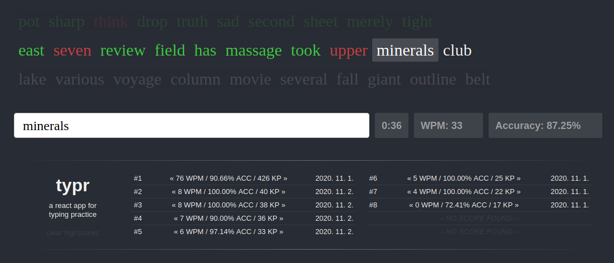

# Typr - A React App for Typing Practice

Typr is currently live and hosted on Heroku -- access it by going to https://react-typr.netlify.app/.

This app was created by [@kurtdeleon](https://github.com/kurtdeleon) as a hobby project so he could practice making stuff with React hooks. The site is directly inspired by the typing practice format of [10FastFingers.com](https://10fastfingers.com/typing-test/english).

The formulas used to compute words-per-minute (WPM) and accuracy were taken from the equations listed on [SpeedTypingOnline.com](https://www.speedtypingonline.com/typing-equations). As for the statistics regarding WPM speed, Juerd Waalboer's [Typing Test @ AOEU](https://typing-speed-test.aoeu.eu/) proved useful since they have their histogram displayed for public use.

Bootstrapped with [Create React App](https://github.com/facebook/create-react-app).
